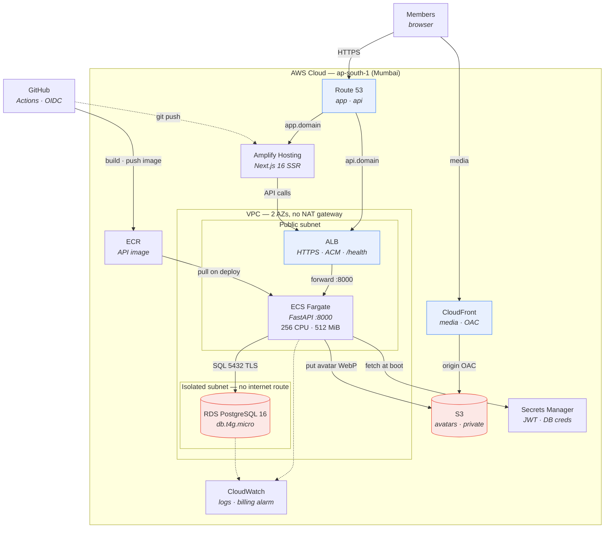

# ClubHub on AWS — the deployment that wasn't

A complete, synthesizable AWS deployment for ClubHub: VPC, RDS, Fargate behind an ALB, S3 +
CloudFront, Secrets Manager, and a keyless GitHub OIDC pipeline. It was designed, written as
CDK TypeScript, costed to the line item — and then **deliberately not deployed**.

This folder is the design and the reasoning. The section that matters most is
[Why this was deferred](#why-this-was-deferred).

| | |
|---|---|
| **Status** | Designed and code-complete. Never deployed. Superseded 2026-08. |
| **Cost, had it run** | ~$46–52/month ([full breakdown](./COST-MODEL.md)) |
| **What shipped instead** | One $12/month droplet — [ADR-0004](../docs/adr/0004-hosting-platform.md), [`docs/DEPLOYMENT.md`](../docs/DEPLOYMENT.md) |
| **The CDK source** | Tag [`aws-cdk-final`](https://github.com/VishaalPillay/ClubHub/tree/aws-cdk-final/infra) |

## Contents

| Document | What it covers |
|---|---|
| [ARCHITECTURE.md](./ARCHITECTURE.md) | Construct-by-construct design, with the reasoning behind each choice |
| [COST-MODEL.md](./COST-MODEL.md) | Line-item costs, the credits cliff, and the comparison that ended it |
| [RUNBOOK.md](./RUNBOOK.md) | The full deployment procedure, preserved unexecuted |
| [KNOWN-GAPS.md](./KNOWN-GAPS.md) | What the code did *not* do that the docs claimed |
| [diagrams/](./diagrams) | Mermaid sources, the editable `.drawio`, and the exported PNG |

---

## The architecture

The editable, icon-accurate source is
[`diagrams/clubhub-aws-architecture.drawio`](./diagrams/clubhub-aws-architecture.drawio) — see
[`diagrams/README.md`](./diagrams/README.md) for the one-time PNG export step.

The most interesting mechanism in the system — refresh-token rotation with reuse detection — was
never drawn at all, so it is now in [`diagrams/auth-sequence.mmd`](./diagrams/auth-sequence.mmd).

## The stack in one table

| Layer | Resource | Configuration |
|---|---|---|
| Network | VPC | 2 AZs, public + isolated subnets, **zero NAT gateways** |
| Compute | ECS Fargate | 256 CPU / 512 MiB, `desiredCount: 1`, circuit breaker with rollback |
| Ingress | ALB | HTTPS, ACM cert via DNS validation, `/health` target check |
| Database | RDS PostgreSQL 16.4 | `db.t4g.micro`, 20 GB gp3, encrypted, 7-day backups, `RemovalPolicy.SNAPSHOT` |
| Media | S3 + CloudFront | Private bucket (`BLOCK_ALL`), Origin Access Control, `RETAIN` on delete |
| Secrets | Secrets Manager | Generated 64-char JWT key; RDS-generated DB credentials |
| Frontend | Amplify Hosting | Next.js SSR, connected to GitHub directly |
| CD | GitHub Actions → OIDC | No static AWS keys anywhere |
| Guardrail | Budgets | $40/month, email alert at 80% actual |

Full reasoning for each: [ARCHITECTURE.md](./ARCHITECTURE.md).

---

## Why this was deferred

The design is sound. The economics were not.

**The numbers.** ~$46–52/month, of which the ALB alone is ~$18 and is structurally unavoidable
for HTTPS into Fargate. AWS credits would have covered roughly **four months**. After that, a
project with zero revenue, built by a student with a total budget of about ₹1,000, owes AWS
₹4,000/month forever.

**What replaced it.** The GitHub Student Developer Pack provides a DigitalOcean credit of
**$13/month for 24 months** and a free domain. A single $12/month droplet running the same
containers via Docker Compose costs **₹0 out of pocket for two years** — and buys *more* than the
free tier of any PaaS: no cold starts, no 30-day database expiry, no commercial-use restriction.

**Why the migration was cheap.** This is the part worth noticing. Moving clouds changed **zero
application code**. The container contract, the two-backend storage interface, and the
`COOKIE_SECURE` / `CORS_ORIGINS` configuration absorbed the entire change. The AWS design had
already forced every environment-specific decision out of the application and into configuration
— so the app turned out to be portable by construction, and the work here was not wasted.

**What was given up, honestly:** multi-AZ redundancy, managed backups, horizontal scale, and a
load balancer that outlives the box. Those are real. They are also not what a student club
management app needs in its first year, and every one of them is a known, documented exit.

## What carried over unchanged

| From the AWS design | Where it lives now |
|---|---|
| Discrete `POSTGRES_*` secrets assembled into a DSN at boot | `backend/entrypoint.sh` — unchanged |
| Migrations run before the process serves traffic | `backend/entrypoint.sh` — unchanged |
| Exactly one API instance, so in-process rate limiting is correct | `minHealthyPercent: 0` → structurally true with one container |
| One storage interface, two backends | `backend/app/core/storage.py` — S3 → Cloudflare R2, one new setting |
| `app.<domain>` + `api.<domain>` share a registrable domain | Why `SameSite=Lax` still works with no code change ([ADR-0002](../docs/adr/0002-auth-token-contract.md)) |
| Secrets never in the image, never in git | `.env.prod`, `chmod 600`, git-ignored |

The one lesson that came *out* of this folder and changed the new build is in
[KNOWN-GAPS.md §1](./KNOWN-GAPS.md): the media hostname must be one you own, or the storage
backend becomes a one-way door.
