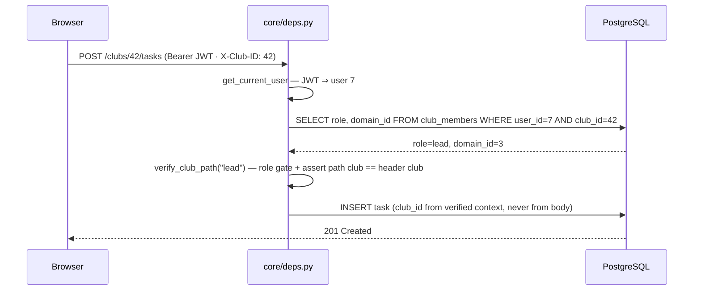
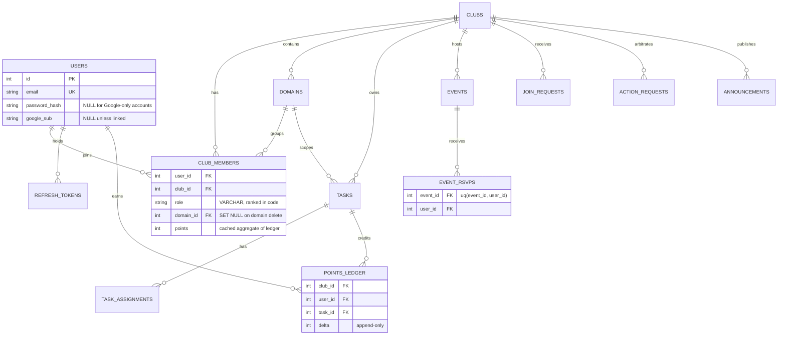

<div align="center">

# ClubHub

**Multi-tenant SaaS for running student clubs — one account, many clubs; seven-tier RBAC, sub-teams, weighted tasks, an auditable points economy, events, and announcements.**

[](https://github.com/VishaalPillay/ClubHub/actions/workflows/ci.yml)


FastAPI · SQLModel · Alembic · React 19 · TanStack Query · ECS Fargate · RDS · CloudFront

</div>

---

ClubHub is a GitHub-style tenancy model applied to student organizations: identity is global, authority is per-club. A student signs up once, then creates or joins any number of clubs; inside each club they hold a role in a seven-tier hierarchy, work inside sub-teams ("domains"), earn points through completed tasks, and everything they can see or touch is derived server-side from their membership — never from what the client claims.

This README focuses on the **architecture**: how tenant isolation is enforced structurally, how the data layer is engineered, and how the AWS deployment is designed for security and cost. Operational detail lives in [`docs/DEPLOYMENT.md`](docs/DEPLOYMENT.md) and the accepted decisions in [`docs/adr/`](docs/adr/).

## Design highlights

The decisions a reviewer should probe first, and where each is enforced:

| Decision | Rationale | Where |
|---|---|---|
| **Tenancy = JWT identity + per-request club header, never body-supplied `club_id`** | A forged payload cannot write into another tenant; context is resolved from the caller's own membership row | `app/core/deps.py` |
| **Single chokepoint for tenant-scoped reads** (`tenant_query`) | One place to get the `WHERE club_id =` filter right, one place to audit | `app/core/tenant.py` |
| **Access token (15 min, in memory) + rotating opaque refresh token (httpOnly cookie), reuse ⇒ revoke all sessions** | No bearer material in `localStorage`; a replayed refresh token burns the whole session family | [ADR-0002](docs/adr/0002-auth-token-contract.md), `app/modules/auth/service.py` |
| **Enums stored as `VARCHAR`, validated at the edge, ranked in code** | Roles/statuses evolve; `ALTER TYPE` migrations are painful and rank must never depend on enum ordinals | [ADR-0001](docs/adr/0001-enum-storage-as-varchar.md), `app/core/permissions.py` |
| **Append-only points ledger + transactionally-maintained cached aggregate** | Leaderboard reads are `O(members)` with an index, while every award stays auditable and idempotent | `app/models/task.py`, `modules/tasks/service.py` |
| **Schema owned exclusively by Alembic — and the migrations are the tested path** | The test suite rebuilds its database from `alembic upgrade head`, so model↔migration drift fails CI, not production | `backend/tests/conftest.py`, [ADR-0003](docs/adr/0003-execution-model.md) |
| **No NAT gateway: Fargate in a public subnet, security-group-locked to the ALB** | Same effective exposure as private-subnet-plus-NAT at ~$33/mo less; the trade-off is explicit, not accidental | `infra/lib/network.ts`, `infra/lib/api.ts` |
| **DB credentials injected as discrete secrets; DSN assembled at boot** | The password never exists in task-definition plaintext or an image layer | `infra/lib/api.ts`, `backend/entrypoint.sh` |
| **Deploys are `cdk deploy` via GitHub OIDC — no static cloud keys anywhere** | Short-lived, repo-scoped credentials; the CI role can only assume the CDK bootstrap roles | `.github/workflows/deploy.yml` |

---

## Multi-tenancy: isolation as a structural property

Identity and tenancy are deliberately separated. The JWT carries only `sub` (user id). The active club travels per-request in an `X-Club-ID` header, and the server resolves what the caller may do by loading their own `club_members` row — role, domain, and all.



Isolation is enforced in three independent layers, so no single forgotten check is fatal:

1. **Context is authoritative.** `get_club_context` returns a `ClubContext(user_id, club_id, role, domain_id)` built from the caller's membership. Non-members of the header club get `403` before any handler runs.
2. **Path/header binding.** Every `/clubs/{club_id}/...` route depends on `verify_club_path(min_role)`, which additionally asserts the *path* club equals the *header* club (`400 CLUB_ID_MISMATCH`). A privileged user of club A cannot route a write into club B by editing the URL.
3. **Scoped reads by construction.** Club-owned SELECTs go through `tenant_query(Model, ctx)`, which pre-applies `.where(Model.club_id == ctx.club_id)`. The filter is not something each endpoint remembers — it is something each endpoint cannot omit.

`tests/test_tenancy.py` proves the invariants over HTTP, including the forged-path case.

## Authentication: a session contract, not just a login box

Full contract in [ADR-0002](docs/adr/0002-auth-token-contract.md). The shape:

- **Access token** — 15-minute JWT, returned in the response body, held **in memory** on the client (`lib/auth/tokenStore.ts`). It never touches `localStorage`, so XSS cannot exfiltrate a long-lived credential.
- **Refresh token** — opaque 384-bit random value, stored **sha256-hashed** at rest, delivered in an `httpOnly; SameSite=Lax` cookie scoped to `Path=/auth`. `POST /auth/refresh` **rotates** it on every use; presenting an already-rotated token is treated as theft and **revokes every session for that user** (`401 REFRESH_REUSED`).
- **Google sign-in** — the client obtains a Google Identity Services ID token; `POST /auth/google` verifies it server-side against `GOOGLE_CLIENT_ID`, then resolves: known `google_sub` → sign in; verified matching email → link to the existing account; otherwise → create a **password-less** account (`password_hash = NULL`, and password login is structurally rejected for it). Same session contract as email/password.
- The axios client single-flight-refreshes on 401 and retries, so token expiry is invisible to feature code.

Brute-force surface is rate-limited (slowapi, keyed by `X-Forwarded-For` since the API sits behind an ALB): `10/min` on register/login/google, `30/min` on join-code endpoints — breaches return the same machine-readable envelope as every other error (`429 RATE_LIMITED`).

## Data layer



`club_members` is simultaneously the membership join table and the RBAC source of truth — role, domain, and cached points live there, per club.

**Engineering decisions under the schema:**

- **Migrations are the only schema authority.** No `create_all` anywhere. The container entrypoint runs `alembic upgrade head` before serving; the test suite drops and rebuilds `clubhub_test` *from the migration chain* every run — so a migration that diverges from the models is a failing test, not a production surprise.
- **Real Postgres, deliberately.** The schema uses `JSONB` (per-club `enabled_roles`), `CHECK` constraints, and `ON CONFLICT` — the suite runs against PostgreSQL, never SQLite, and each test executes inside an outer transaction rolled back at teardown (endpoint commits become savepoints), giving full isolation without per-test truncation.
- **Ledger + cached aggregate.** Completing a task appends immutable `points_ledger` rows and updates `club_members.points` in the same transaction. Re-completing is idempotent (no double-award); re-opening never claws back — the ledger is append-only history, the column is a read model. `events.attendees` follows the identical pattern for RSVPs, with `uq_event_rsvp(event_id, user_id)` making RSVP writes idempotent at the constraint level.
- **Explicit `ON DELETE` semantics per relationship.** Owned rows cascade (`club_members`, `tasks`, `rsvps` die with their club); authorship restricts (`clubs.owner_id`, `announcements.author_id` — you cannot delete a user out from under records that attribute action to them); optional grouping nulls (`domain_id SET NULL` — deleting a sub-team never deletes its people or work).
- **Tenant-led composite indexes.** Every hot path is prefix-scoped by tenant: `(club_id, points)` for the leaderboard, `(club_id, status)` for task/request/event queues, `(club_id, scope)` for announcements. Index shape mirrors query shape.
- **Enums as `VARCHAR`** ([ADR-0001](docs/adr/0001-enum-storage-as-varchar.md)): values are validated by Pydantic at the boundary and **ranked** by `ROLE_HIERARCHY` in `app/core/permissions.py` — never by enum ordinals, and never by Postgres `ALTER TYPE` ceremony when a role is added.

## Authorization

```
member < associate < lead < joint_secretary < secretary < vice_president < president
```

All RBAC truth lives in `app/core/permissions.py`; endpoints declare a minimum role via `verify_club_path("<role>")` and never re-implement checks. Three helpers encode the policy: `role_at_least` (gating), `can_manage` (must **strictly** outrank the target — equals cannot manage each other), and `can_grant_role` (nobody grants a rank ≥ their own; secretaries cap at granting `lead`). Authority a Lead lacks directly — promotions, removals — flows through an **action-request queue** that a senior role approves, so club governance is itself auditable data.

## AWS architecture

Defined end-to-end in [`infra/`](infra/) (CDK, TypeScript) as **one stack composed of four constructs** — plain object references instead of cross-stack CloudFormation exports, which would lock shared resources against change. Diagram: [`docs/clubhub-aws-architecture.drawio`](docs/clubhub-aws-architecture.drawio) · runbook: [`docs/DEPLOYMENT.md`](docs/DEPLOYMENT.md).

```
                        Route 53 (hosted zone)
      app.<domain> ────────────┐        ┌─────────── api.<domain>
                               ▼        ▼
                  ┌─────────────────┐  ┌────────────────────────────────┐
  Browser ──────▶ │ Amplify Hosting │  │ ALB — HTTPS (ACM), health=/health
                  │ Next.js 16 SSR  │  │   └─▶ ECS Fargate task :8000    │   public subnet
                  └─────────────────┘  └──────────────┬─────────────────┘
                                                      │ SG: 5432 from API SG only
  media CDN ─▶ CloudFront ─▶ S3 (private, OAC)        ▼
                                        RDS PostgreSQL 16 — isolated subnet,
                                        encrypted, no internet route
  Secrets Manager (JWT · DB creds) · CloudWatch + budget alarm · ECR (image asset)
```

**Trust boundaries.** The VPC spans two AZs with two subnet tiers. The database sits in an **isolated** subnet — no route to or from the internet exists; its security group admits port 5432 from the API's security group and nothing else. The API task sits in the **public** subnet with a public IP but an SG that only accepts the ALB. That placement is the deliberate cost decision: it removes the NAT gateway (~$33/mo) that a private-subnet task would need for ECR/S3/Google egress, with the same effective ingress posture.

**Secrets discipline.** RDS generates its credentials directly into Secrets Manager; ECS injects them into the task as discrete fields (`POSTGRES_HOST/USER/PASSWORD/…`) and the entrypoint assembles `DATABASE_URL` (+ `sslmode=require`) in process memory. The JWT key is a separate generated secret. Nothing sensitive exists in an image layer, task definition, or the repo — and the app **refuses to boot** if the JWT secret is missing or the placeholder.

**Media path.** Avatars are Pillow-verified (decode-or-reject, decompression-bomb guarded), EXIF-normalized, center-cropped to 512² WebP, and written under content-unique keys through a two-backend storage interface (`local` disk for dev, S3 for prod — callers never branch). The bucket blocks all public access; CloudFront reads it via Origin Access Control, so the CDN is the only reader and objects are cached as immutable.

**Deploy semantics.** The image is a CDK asset (`ContainerImage.fromAsset`) — `cdk deploy` builds, pushes, and rolls in one converging operation, with a deployment circuit breaker that auto-rolls-back a task that can't pass `/health`. The service runs `minHealthyPercent: 0` **on purpose**: migrations run on boot, and a zero-downtime overlap of old/new tasks would race `alembic upgrade head`; a few seconds of deploy downtime is the honest MVP trade (the documented upgrade path is a pre-traffic migration task). Frontend and cookie architecture co-operate here: `app.` and `api.` share a registrable domain, so the `SameSite=Lax` refresh cookie works cross-subdomain **with zero code change** — that constraint is *why* the design insists on a custom domain rather than raw AWS hostnames.

**Cost model.** Mode A lists at ~**$46–52/mo** (Fargate ≈ $9, ALB ≈ $18, RDS t4g.micro ≈ $15, the rest single digits) — fully covered by new-account credits, with a budget alarm wired at 80% of $40. A documented **Mode B** fallback (single Lightsail box running the same containers, S3/CloudFront retained) lands at ~$5–20/mo when credits end; because everything is containerized, the move is a redeploy, not a rewrite.

**Pipelines.** CI runs ruff + the full suite against a Postgres 16 service container (the same migration-built database as local) plus the frontend build. CD assumes an AWS role via **GitHub OIDC** — the trust policy pins the exact repo and branch, the role can only assume CDK's bootstrap roles, and no long-lived cloud key exists anywhere in the system.

## Codebase

```
backend/app/
├── core/        # the cross-cutting spine: config, db, security, deps (tenant guards),
│                #   permissions (RBAC truth), tenant.py, ratelimit, storage, exceptions
├── models/      # SQLModel tables, centralized per aggregate (avoids cross-module import cycles)
└── modules/     # vertical slices — auth, clubs, members, domains, join/action requests,
                 #   tasks, leaderboard, announcements, events, users
frontend/src/
├── app/         # App Router: (public) marketing+auth · (app)/portal · (app)/c/[clubId]/…
├── features/    # marketing, auth wizard, club pages — logic lives here, routes stay thin
└── lib/         # typed axios client (Bearer + X-Club-ID injection, single-flight refresh)
infra/           # CDK: network / database / media / api constructs + one stack
```

Every module is the same three files — `router.py` (thin: routes + role gate), `schemas.py` (the contract), `service.py` (fat: logic, raising `AppError`) — and every error leaves the API as `{"detail", "code"}` with a stable machine code, which the frontend client switches on. The active club lives in the **URL** (`/c/[clubId]`), not client storage: deep links are shareable, the back button works, and the tenant header derives from one source of truth.

**Verification:** 169 tests against real Postgres (tenancy attacks, auth-contract properties including refresh-reuse revocation, RBAC edges, ledger idempotency, upload rejection paths, rate-limit firing) · ruff · `tsc --noEmit` + `cdk synth` for the infrastructure.

## API surface

Club-scoped routes require `Authorization: Bearer` **and** `X-Club-ID`; identity-scoped routes take only the bearer. Full schemas at `/docs`.

| Area | Endpoints |
|---|---|
| Auth | `POST /auth/register` · `/login` · `/google` · `/refresh` · `/logout` · `GET /auth/me` |
| Profile | `GET/PUT /users/me` · `POST /users/me/avatar` |
| Clubs | `POST /clubs` · `GET /clubs/my` · `/directory` · `/lookup?code=` · `GET/PUT /clubs/{id}` |
| Joining | `POST /clubs/join` · `GET /clubs/pending` · `DELETE /clubs/join/{rid}` · approve/reject queue under `/clubs/{id}/requests` |
| Members & governance | `GET /clubs/{id}/members` · role change · remove · `POST /clubs/{id}/action-requests` + approve/reject |
| Domains | CRUD under `/clubs/{id}/domains` |
| Tasks & points | CRUD + `POST /clubs/{id}/tasks/{tid}/assign` · `GET /clubs/{id}/leaderboard?domain_id=` |
| Events | CRUD under `/clubs/{id}/events` · idempotent `POST/DELETE …/{eid}/rsvp` |
| Announcements | CRUD under `/clubs/{id}/announcements` (scope-aware visibility) |

## Running it

```bash
cp .env.example .env            # set JWT_SECRET_KEY (python -c "import secrets; print(secrets.token_hex(32))")
docker compose up --build       # Postgres + API; migrations apply on boot → http://localhost:8000/docs
docker compose exec api pytest  # full suite against a migration-built database
cd frontend && npm i && npm run dev   # http://localhost:3000
```

Deploying to AWS is a guided, ~30-minute sequence — account, hosted zone, `cdk bootstrap`, one `cdk deploy`, Amplify connect, OIDC role — documented step-by-step with troubleshooting in [`docs/DEPLOYMENT.md`](docs/DEPLOYMENT.md).

## Status

Application, infrastructure code, and CI/CD are complete and verified. What remains is operational: executing the first `cdk deploy` against a live account/domain, then post-launch hardening (pre-traffic migration task for zero-downtime deploys, observability dashboards, Postgres row-level security as a fourth tenancy layer).

---

<div align="center">
<sub>Built by Vis · Decisions in <a href="docs/adr/">docs/adr</a> · Deployment in <a href="docs/DEPLOYMENT.md">docs/DEPLOYMENT.md</a></sub>
</div>
