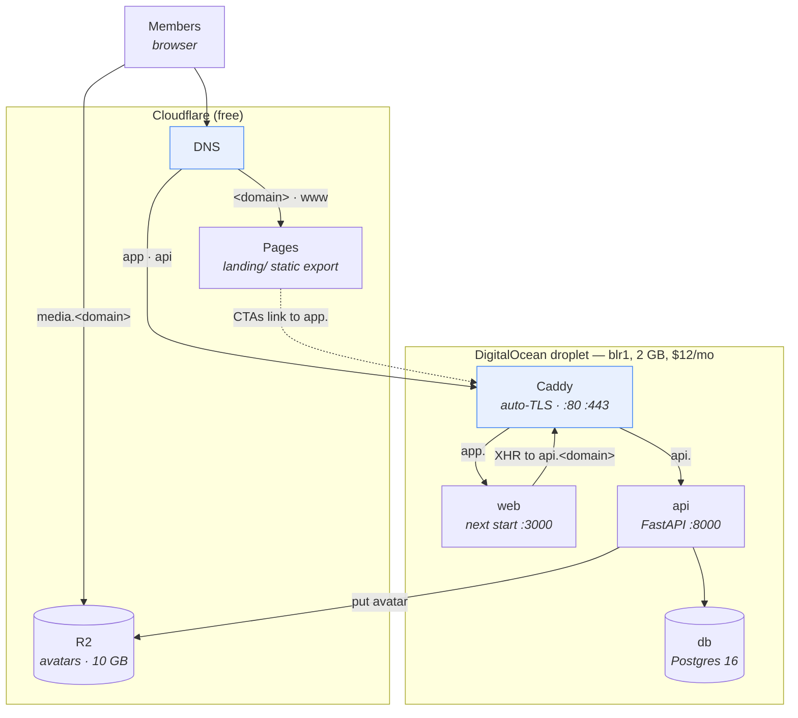

# ClubHub — Deployment Runbook

Take ClubHub from your laptop to a live URL, on a stack the GitHub Student Developer Pack pays
for. Target cost: **$14.40/month, fully covered by credit for 24 months.**

> Looking for the AWS design? It was built and deliberately not deployed — see
> [`AWS/`](../AWS/README.md) and [ADR-0004](./adr/0004-hosting-platform.md).

**The shape of it.** One DigitalOcean droplet runs everything behind Caddy, which gets TLS
certificates automatically. The marketing landing page is a separate static site on Cloudflare
Pages. Avatars go to Cloudflare R2.



Everything below assumes `<domain>` is your domain (e.g. `clubhub.me`). Substitute throughout.

---

## 0. Prerequisites

| Thing | Where | Note |
|---|---|---|
| GitHub Student Developer Pack | [education.github.com/pack](https://education.github.com/pack) | Verification can take 24–72h — **start here** |
| Domain | Namecheap `.me`, free via the Pack | Renewal is ~$20/yr; budget for it or migrate |
| DigitalOcean account | Via the Pack ($13/mo × 24 months) | A payment method is required even with credit |
| Cloudflare account | Free | DNS + Pages + R2 |
| Google Cloud project | Free | OAuth web client for Google sign-in |
| Local | Docker, Node 20+, an SSH key | |

> **Sequencing matters.** Steps 1 and 2 are gated on external clocks (student verification, DNS
> propagation). Start them on day one; everything else can proceed in parallel.

---

## 1. Domain and DNS

1. Claim the `.me` domain through the Pack's Namecheap offer.
2. Create a free Cloudflare account, **Add a site**, enter your domain.
3. Cloudflare gives you two nameservers. Set them at Namecheap (*Domain → Nameservers → Custom DNS*).
   Propagation takes up to 24h; usually far less.
4. Once Cloudflare shows the zone as **Active**, add the records from step 5 below.

> **Do not register under `co.me`, `net.me` or similar.** Those are public suffixes, which would
> put `app.` and `api.` on different registrable domains and break the auth cookie. A plain
> `<name>.me` is what you want — see [ADR-0002](./adr/0002-auth-token-contract.md).

---

## 2. The droplet

Create a droplet: **Ubuntu 24.04 LTS**, **Basic → Regular → 2 GB / 1 vCPU / 50 GB ($12/mo)**,
region **Bangalore (blr1)**, **SSH key** authentication, and tick **Enable backups** (+$2.40/mo).

> **Do not take the $6 / 1 GB tier.** `next build` alone peaks near 1–1.5 GB and shares the box
> with Postgres, uvicorn, Pillow and Caddy.

Then harden it and install Docker:

```bash
ssh root@<droplet-ip>
```

```bash
adduser clubhub && usermod -aG sudo clubhub && rsync --archive --chown=clubhub:clubhub ~/.ssh /home/clubhub
```

Disable password login (`/etc/ssh/sshd_config`: `PasswordAuthentication no`, `PermitRootLogin no`),
then `systemctl restart ssh`. Firewall:

```bash
ufw allow OpenSSH && ufw allow 80 && ufw allow 443 && ufw --force enable
```

**Add 2 GB of swap — this is not optional**, it is what turns a build OOM-kill into a slow build:

```bash
fallocate -l 2G /swapfile && chmod 600 /swapfile && mkswap /swapfile && swapon /swapfile && echo '/swapfile none swap sw 0 0' >> /etc/fstab && sysctl -w vm.swappiness=10
```

Install Docker:

```bash
curl -fsSL https://get.docker.com | sh && usermod -aG docker clubhub
```

> **Note on UFW and Docker.** Docker's iptables rules bypass UFW for *published* ports. That is
> precisely why `docker-compose.prod.yml` lets only Caddy publish anything — the compose file is a
> security boundary, not just a topology.

---

## 3. Cloudflare R2 (avatar storage)

1. **R2 → Create bucket** → `clubhub-media`.
2. **Settings → Custom Domains → Connect domain** → `media.<domain>`. Cloudflare creates the DNS
   record and certificate.
3. **R2 → API → Create API token**, *Object Read & Write*, scoped to this bucket. Save the Access
   Key ID and Secret — the secret is shown once.
4. Note your account ID; the endpoint is `https://<account_id>.r2.cloudflarestorage.com`.

> **Use `media.<domain>`, never the `*.r2.dev` URL.** Avatar URLs are written verbatim into
> `users.avatar_url` and never rewritten, so a provider hostname makes the storage backend a
> one-way door. This is the single most consequential line in `.env.prod` — see
> [ADR-0004](./adr/0004-hosting-platform.md).

---

## 4. Google OAuth

In [Google Cloud Console](https://console.cloud.google.com) → **APIs & Services → Credentials**,
create an **OAuth client ID → Web application**. Under *Authorized JavaScript origins* add:

- `https://app.<domain>`
- `http://localhost:3000` (keep for local dev)

No redirect URIs are needed — this is the GIS ID-token flow, not a redirect flow. Origin changes
can take a few hours to take effect, so do this early.

The client ID goes in **both** `GOOGLE_CLIENT_ID` (backend) and `NEXT_PUBLIC_GOOGLE_CLIENT_ID`
(frontend build arg). While it is empty the button hides and `/auth/google` returns 503.

---

## 5. DNS records

| Name | Type | Value | Proxy |
|---|---|---|---|
| `<domain>` | CNAME | `<project>.pages.dev` | 🟠 **Proxied** |
| `www` | CNAME | `<project>.pages.dev` | 🟠 **Proxied** |
| `app` | A | `<droplet-ip>` | ⚪ **DNS only** |
| `api` | A | `<droplet-ip>` | ⚪ **DNS only** |
| `media` | — | created by R2 in step 3 | 🟠 Proxied |

> ### ⚠ The single biggest launch trap
>
> **`app` and `api` must be grey-cloud (DNS only).** If they are proxied, Cloudflare terminates
> TLS at its edge, Caddy's ACME challenge never reaches the droplet, and certificate issuance
> fails. With Cloudflare's SSL mode on *Flexible* you additionally get an infinite redirect loop.
> **The symptoms look like a Caddy bug and are not.**
>
> Verify: `dig +short app.<domain>` must return the droplet IP, not a Cloudflare address.

---

## 6. First deploy

```bash
sudo mkdir -p /srv/clubhub && sudo chown clubhub:clubhub /srv/clubhub && git clone https://github.com/VishaalPillay/ClubHub.git /srv/clubhub
```

Edit `Caddyfile` — replace `app.example.me` / `api.example.me` with your domains and set a real
`email` for Let's Encrypt expiry notices.

Write the secrets file:

```bash
cp /srv/clubhub/.env.prod.example /srv/clubhub/.env.prod && chmod 600 /srv/clubhub/.env.prod
```

Fill in every blank. Generate the two secrets:

```bash
python3 -c "import secrets; print('JWT_SECRET_KEY=' + secrets.token_hex(32)); print('POSTGRES_PASSWORD=' + secrets.token_urlsafe(32))"
```

> `JWT_SECRET_KEY` is required by **both** the app and `alembic upgrade head` — `alembic/env.py`
> imports the app config, so a missing secret fails the migration, not just the server.

Bring it up:

```bash
cd /srv/clubhub && docker compose -f docker-compose.prod.yml up -d --build
```

Watch certificate issuance — this is where a mis-set orange cloud reveals itself:

```bash
docker compose -f docker-compose.prod.yml logs -f caddy
```

---

## 7. The landing page (Cloudflare Pages)

**Workers & Pages → Create → Pages → Connect to Git**, select the repo, then:

| Setting | Value |
|---|---|
| Production branch | `main` |
| Framework preset | None (or *Next.js (Static HTML Export)*) |
| Build command | `npm run build` |
| Build output directory | `out` |
| Root directory | `landing` |

Environment variables (**Production** and **Preview**):

| Variable | Value |
|---|---|
| `NODE_VERSION` | `20` |
| `NEXT_PUBLIC_APP_URL` | `https://app.<domain>` |
| `NEXT_PUBLIC_SITE_URL` | `https://<domain>` |

These are inlined at build time, so set them **before** the first production build. Then **Custom
domains** → add `<domain>` and `www.<domain>`.

---

## 8. Smoke test

Run in this order — each step is the cheapest probe of the layer beneath it.

1. `curl https://api.<domain>/health` → `{"status":"ok","version":"0.1.0"}`, valid certificate.
2. `https://app.<domain>/` → redirects to `/login`.
3. Register with email → country/college step → lands on `/portal`.
4. **Reload the logged-in tab → still logged in.** This one action exercises the whole
   cookie / CORS / `COOKIE_SECURE` / same-site contract.
5. Google sign-in → new user goes to the profile step, returning user straight to `/portal`.
6. **Upload an avatar** → it renders, and the URL is `https://media.<domain>/avatars/…`.
   **Do not skip this.** `boto3` is imported lazily, so bad R2 credentials fail *here* and nowhere
   earlier.
7. Create a club → dashboard, tasks, leaderboard.
8. Hit `/auth/login` more than 10×/min → `429 RATE_LIMITED`. Then resend with
   `-H 'X-Forwarded-For: 1.2.3.4'` and confirm it **still** 429s — that proves the rate-limit key
   can't be spoofed.
9. Landing page apex → CTA reaches `app.<domain>/register`; the app's wordmark returns to the apex.

---

## 9. Operations

### Deploying

```bash
/srv/clubhub/scripts/deploy.sh
```

`git pull` + `up -d --build` + health wait. **Move to a registry-based pipeline when this OOMs, or
takes the site down for more than ~60s** — that is the trigger, decided in advance. The upgrade is
to build images in GitHub Actions, push to GHCR, and reduce the droplet's job to `pull` + swap.

### Cron

```bash
sudo crontab -e
```

```cron
15 3 * * *  /srv/clubhub/scripts/backup.sh              >> /var/log/clubhub-backup.log 2>&1
45 3 * * 0  /srv/clubhub/scripts/prune-refresh-tokens.sh >> /var/log/clubhub-prune.log  2>&1
```

Set `RCLONE_REMOTE` in `backup.sh`'s environment to replicate dumps off-box to R2. **A backup that
only exists on the droplet does not protect against losing the droplet.**

### Rehearse a restore — before you announce

```bash
docker compose -f docker-compose.prod.yml exec -T db createdb -U clubhub restore_test
docker compose -f docker-compose.prod.yml exec -T db pg_restore -U clubhub -d restore_test < /srv/backups/clubhub-<date>.dump
```

An untested backup is a hypothesis.

### Migrations

Routine migrations apply automatically on boot. For anything destructive or long-running, do it
deliberately:

```bash
./scripts/backup.sh && docker compose -f docker-compose.prod.yml run --rm api alembic upgrade head && docker compose -f docker-compose.prod.yml up -d --build
```

---

## 10. Troubleshooting

| Symptom | Cause & fix |
|---|---|
| Caddy logs show ACME challenge failures | `app`/`api` are orange-clouded in Cloudflare. Set them to **DNS only** and check with `dig +short`. |
| Infinite redirect loop on `app.<domain>` | Same cause, plus Cloudflare SSL mode set to *Flexible*. Grey-cloud the record. |
| `ImportError: The requests library is not installed` | A dependency present only via a dev extra. Reproduce with `docker build --build-arg INSTALL_DEV=false ./backend` — CI's `prod-image` job guards this. |
| Rate limiting never triggers / is bypassable | uvicorn is ignoring proxy headers. Confirm `FORWARDED_ALLOW_IPS=*` on the `api` service **and** `header_up X-Forwarded-For {remote_host}` in the Caddyfile. |
| `next build` killed during deploy | Out of memory. Confirm the 2 GB swapfile is active (`free -h`), or move to the GHCR pipeline. |
| Changed `NEXT_PUBLIC_*` but nothing happened | They are inlined at **build** time. Needs `up -d --build`, not `restart`. |
| Avatar upload fails with an opaque R2 error | botocore checksum defaults. Uncomment `AWS_REQUEST_CHECKSUM_CALCULATION=when_required` in `.env.prod`. |
| Logged out on every page reload | `COOKIE_SECURE` false over HTTPS, or `CORS_ORIGINS` doesn't exactly match the app origin. |
| API healthy but CORS errors in the browser | `CORS_ORIGINS` must be exactly `https://app.<domain>` — no trailing slash, not the apex. |

Logs: `docker compose -f docker-compose.prod.yml logs -f api` (or `caddy`, `web`, `db`).

---

## 11. Cost and the scaling ceiling

| Item | Monthly |
|---|---|
| Droplet (2 GB) | $12.00 |
| Weekly backups | $2.40 |
| Cloudflare DNS + Pages + R2 | $0.00 |
| Domain (year 1, Student Pack) | $0.00 |
| **Total** | **$14.40** — inside the $13/mo credit, ~$1.40 of true spend |

**What breaks first:** Postgres memory. The droplet runs Postgres, Node and Python in 2 GB, and
`next build` transiently doubles the pressure.

**The exits, in order:** resize the droplet ($24/mo, one reboot) → DigitalOcean Managed Postgres
($15/mo, removes the backup burden) → split web and API onto separate droplets → return to the
[AWS design](../AWS/README.md), whose CDK app still synthesizes at tag `aws-cdk-final`.
